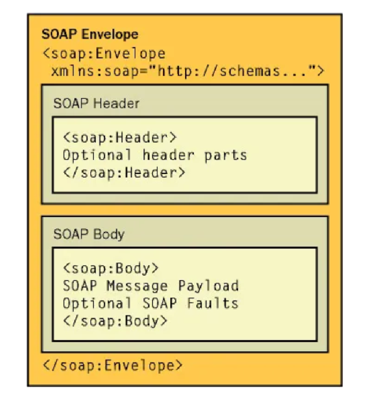

= Spring Boot 4 Webservices Project

:spring_version: current
:spring_boot_version: current
:spring_ws_api: https://docs.spring.io/spring-ws/docs/current/api
:toc:
:icons: font
:source-highlighter: prettify
:project_id: gs-soap-service

This project is based on the guide from https://github.com/spring-guides/gs-producing-web-service/commits?author=bclozel:

- https://spring.io/guides/gs/producing-web-service

== What You Will build

You will build a server that exposes data from various European countries by using a
WSDL-based SOAP web service.

NOTE: To simplify the example, you will use hardcoded data for the United Kingdom, Spain, and Poland.

== SOAP Message Structure

A SOAP message comprises 4 elements:

Key characteristics of SOAP messages in this web service:

* The request messages (like `getCountryRequest`) are sent in the SOAP Body
* The responses (like `getCountryResponse`) are returned in the SOAP Body
* Any errors would be returned as SOAP Faults in the response

== Add WSDL runtime dependency

The service will require the wsdl4j dependency:

The original wsdl4j library (which apparently is not maintained anymore) has been replaced with libre-wsdl4j:

- https://github.com/librewsdl4j/libre-wsdl4j

== Create an XML Schema to Define the Domain

The web service domain is defined in an XML schema file (XSD) that Spring-WS will
automatically export as a WSDL.

Create an XSD file with operations to return a country's `name`, `population`, `capital`,
and `currency`. The following listing (from `src/main/resources/META-INF/schemas/countriesWs.xsd`) shows the
necessary XSD file:

[source,xml,indent=0]
----
include::src/main/resources/META-INF/schemas/countriesWs.xsd[]
----

== Generate Domain Classes Based on an XML Schema

The next step is to generate Java classes from the XSD file. The right approach is to do
this automatically during build time by using a Maven  plugin.

The following listing shows the necessary plugin configuration for Maven:

[source,xml,indent=0]
----
include::pom.xml[tags=xsd]
----

Generated classes are placed in the `target/generated-sources/jaxb/` directory.

The JAXB domain object generation process has been wired into the build
tool's lifecycle, so there are no extra steps to run.

== The Country Service Endpoint

To create a service endpoint, you need only a POJO with a few Spring WS annotations to
handle the incoming SOAP requests. The following listing (from
`src/main/java/ch/dboeckli/soap/service/producingwebservice/CountrySoapEndpoint`) shows such a class:

[source,java]
----
include::src/main/java/ch/dboeckli/soap/service/producingwebservice/CountrySoapEndpoint.java[]
----

The `@Endpoint` annotation registers the class with Spring WS as a potential
candidate for processing incoming SOAP messages.

The `@PayloadRoot` annotation is then used by Spring WS to pick the handler
method, based on the message's `namespace` and `localPart`.

The `@RequestPayload` annotation indicates that the incoming message
will be mapped to the method's `request` parameter.

The `@ResponsePayload` annotation makes Spring WS map the returned
value to the response payload.

NOTE: In all of these chunks of code, the `io.spring.guides` classes will report
compile-time errors in your IDE unless you have run the task to generate the domain
classes based on the WSDL.

== Expose the soap service

Now we need to expose the service so that clients can fetch the WSDL definition.
Spring Boot will scan all "*.xsd" and "*.wsdl" files in the configured location.
So first, we'll need to declare the location of our schema files by editing `src/main/resources/application-local.yaml`:

[source,yaml]
----
include::src/main/resources/application-local.yaml[]
----

Spring Boot will create `SimpleXsdSchema` or `DefaultWsdl11Definition` beans with their names matching file names.
Here, we can expect a `SimpleXsdSchema` bean named `countriesWs` and we can use it to create a WSDL bean for exposing it.
For that, let's create a new `src/main/java/ch/dboeckli/soap/service/producingwebservice/config/WebServiceConfig.java` file
with the following content:

[source,java]
----
include::src/main/java/ch/dboeckli/soap/service/producingwebservice/config/WebServiceConfig.java[]
----

The `DefaultWsdl11Definition` exposes a standard WSDL 1.1 by using the configured `XsdSchema`.

IMPORTANT: The bean name for `DefaultWsdl11Definition` determines the URL under
which the generated WSDL file is available. In this case, the WSDL will be available under
`http://<host>:<port>/services/countries.wsdl`.

By default, they will be exposed on the `"/services"` HTTP endpoint, but this can be customized
with the `spring.webservices.path` property.

== Test the Application

use the http request file under:
[source,json]
----
include::httpRequests/soapRequest/getCountryRequest.http[]
----

As a result, you should see the following response:

[source,xml]
----
<?xml version="1.0"?>
<SOAP-ENV:Envelope xmlns:SOAP-ENV="http://schemas.xmlsoap.org/soap/envelope/">
  <SOAP-ENV:Header/>
  <SOAP-ENV:Body>
    <ns2:getCountryResponse xmlns:ns2="https://spring.io/guides/gs-producing-web-service">
      <ns2:country>
        <ns2:name>Spain</ns2:name>
        <ns2:population>46704314</ns2:population>
        <ns2:capital>Madrid</ns2:capital>
        <ns2:currency>EUR</ns2:currency>
      </ns2:country>
    </ns2:getCountryResponse>
  </SOAP-ENV:Body>
</SOAP-ENV:Envelope>
----
